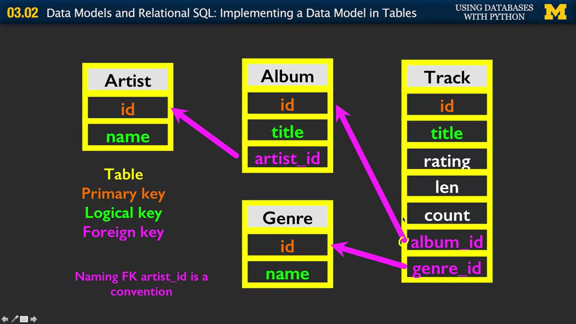

# 一些学python过程中记录的点

## 杂项

1. 代码的四种模式：顺序、条件、循环、存储并重复使用（即函数）。
2. 空类型 None  ``if x is None:``

## if语句

分为if、else；if、elif、else。注意只会取一个执行。

``not``可以和if连用，表示对逻辑的反转。

## try/expect

消除或捕捉回溯（traceback）的一种方式，在已经知道部分代码可能出现错误的时候可以使用。

```py
#示例
str = 'hello world'
try:
    istr = int(str)
except:
    istr = 1

print('istr is', istr)

#从键盘输入数据
tmp = input('Enter a number: ')
try:
    num = int(tmp)
except:
    num = -1

if num >= 0:
    print('Nice work')
else:
    print('Not a number')
```

## 函数 store(and reused) steps

存储并重复使用的代码片段。和其他语言一样，同样可以进行调用（invoke or call）。print、int、float，都是已经定义好的函数（内置函数）。简单例子：

```py
def thing():
    print('hello')
    print('fun')

thing()    #调用
```

返回值（residual value）

## 循环语句

definite -> for、indefinite -> while

infinite 无限循环

跳出循环：break、continue

## 字符串 String

和C语言相同，字符串的索引同样从零开始，不过由于python的特殊性，新建字符串变得非常简单。字符串之间可以用+连接，可以用大于小于等于对应符号进行判断。

实用函数：

1. len 获得字符串长度。

```py
# 遍历字符串
words = 'hello world'
index = 0
while index < len(words):
    letter = words[index]
    print(index, letter)
    index = index + 1

# 另一种等价写法
index = 0
for letter in words:
    print(index, letter)
    index = index + 1
```

2. 中括号+冒号组合，形如``[a:b]`` 截取字符串（slice 切片），有以下规则：
    1. 生成的区间为左闭右开区间
    2. 当第二个数字的大小超过了整个字符串的长度时，整个截取过程会在字符串的末尾停止。
    3. a、b两个数都不是必须，当缺少一个时可以等价看作0和无穷。**（那么问题来了，如果自己写一个负数或者不成立的区间会出现什么情况呢？）**

3. ``+`` 连接字符串。
4. in 判断一个字符是否在字符串中，并返回布尔值。
5. 字符串属于类，可用``type``查看，而``dir``函数可以返回这个类的所有方法。
6. ``find()``找到字符在字符串中的索引，查找不到返回-1。
7. ``replace()``查找并替换，两个参数。替换所有找到的值。
8. ``lstrip()``、``rstrip()``、``strip()``去掉字符串左、右、两端的空白。

## 文件操作 FILE

handle = open(filename, mode)。newline，一行的结束，我们用'\n'字符来代替，只是一个字符，可以这样定义``stuff = 'x\ny'``这样输出stuff就会自动换行，stuff的字符数为3。

File handle as  a sequence(序列)，把文件把手当作一个序列来使用，可以用for循环遍历其中的所有行。``read()``操作则可以读出整个文件到一个单独的字符串中。

小trick：print()函数再输出内容之后会自动补充一个换行，但当输出的字符串以'\n'结尾时便会造成额外空白的一行。为了解决这个问题，可以使用``rstrip()``去掉原来字符串右边的空白。

使用try/except组合避免错误的文件名导致程序运行出现问题。

## List （好吧我不知道汉语对应什么）

list由两个方括号包围，内部变量之间用逗号分隔，list里可以放任意变量包括另一个list，一个list可以为空。

调用成员函数sort可以对list本身进行排序，排序后可以对其他变量赋值。由于成员函数具有返回值，`` x = data.sort()``这条语句执行后x的值为None。

```python
stuff = list()
stuff.append('book')
stuff.append(99)
print(stuff)
```

**string是一成不变的，我们不能用索引改变string中指定字符的值，相反的，list是可变的，我们能够通过索引改变某个位置元素的值。**（immutable-mutable）

``range()``返回一个由数字构成的list，数字从零开始，小于函数的参数。

和string类似，list同样可以用+连接，也同样可以用:进行切片，可用in判断是否存在并返回布尔值。

list和string的联合，``split()``函数，分割字符串为list。可以设定参数对指定分隔符进行分割，默认分隔符为空格。该函数可以自动识别多个空格，但是不能识别多个自定义的分隔符。

## dictionary 字典

```py
purse = dict()
purse['a'] = 2
purse['b'] = 100
purse['c'] = 45
purse['c'] = purse['c'] + 2

for x in purse
    print(x)    #实际上遍历的是键
```

可以使用花括号新建字典常量，使用冒号连接的键-值对，同样可以为空。

``get()``查询对应键的值，可以设置查找不到时的默认值，避免直接使用时出现错误导致程序无法运行。例如：

```py
# 使用字典统计数目
lpl = dict()
names = ['edg', 'omg', 'rng', 'edg','rw', 'fpx']
for name in names:
    lpl[name] = lpl.get(name, 0) + 1
print(lpl)
```

``keys()``、``values()``、``items()``，返回对应的list。

## tuples 元组

list的有限版本，内容不可变。元组之间可以直接赋值，可以进行比较。``sorted(x)``可以对x进行排序，有多个参数。

```py
>>> t = tuple()
>>> dir(t)
['__add__', '__class__', '__contains__', '__delattr__', '__dir__', '__doc__', '__eq__', '__format__', '__ge__', '__getattribute__', '__getitem__', '__getnewargs__', '__gt__', '__hash__', '__init__', '__init_subclass__', '__iter__', '__le__', '__len__', '__lt__', '__mul__', '__ne__', '__new__', '__reduce__', '__reduce_ex__', '__repr__', '__rmul__', '__setattr__', '__sizeof__', '__str__', '__subclasshook__', 'count', 'index']
>>> (x, y) = (99, 98)
>>> print(y)
98
```

小trick (list comprehension)
```py
>>> c = {'a':1, 'b':3, 'c':23}
>>> print(sorted ( [(v, k) for k, v in c.items()] ))
[(1, 'a'), (3, 'b'), (23, 'c')]
```

## regular expression 正则表达式

wild card 通配符，findall返回list，查找不到返回空的list。字符串满足多个匹配时返回长者，可以用❓避免贪心。小括号可以限制返回值的区间。
[官方说明](https://docs.python.org/zh-cn/3/howto/regex.html)

```py
import re
#使用re.search 代替 startswith
if line.startswith('From:'):
    print(line)

if re.search('^From:', line):
    print(line)

#数据提取
x = 'my name 2 is 23 and 34'
y = re.findall('[0-9]+', x)
print(y)
```

一部分常用：
<table><tbody><tr><td><strong>^</strong></td><td>Matches the beginning of a line</td></tr><tr><td><strong>$</strong></td><td>Matches the end of the line</td></tr><tr><td><strong>.</strong></td><td>Matches any character</td></tr><tr><td><strong>\s</strong></td><td>Matches whitespace</td></tr><tr><td><strong>\S</strong></td><td>Matches any non-whitespace character</td></tr><tr><td><strong>*</strong></td><td>Repeats a character zero or more times</td></tr><tr><td><strong>*?</strong></td><td>Repeats a character zero or more times (non-greedy)</td></tr><tr><td><strong>+</strong></td><td>Repeats a character one or more times</td></tr><tr><td><strong>+?</strong></td><td>Repeats a character one or more times (non-greedy)</td></tr><tr><td><strong>[aeiou]</strong></td><td>Matches a single character in the listed set</td></tr><tr><td><strong>[^XYZ]</strong></td><td>Matches a single character <em>not</em> in the listed set</td></tr><tr><td><strong>[a-z0-9]</strong></td><td>The set of characters can include a range</td></tr><tr><td><strong>(</strong></td><td>Indicates where string extraction is to start</td></tr><tr><td><strong>)</strong></td><td>Indicates where string extraction is to end</td></tr></tbody></table>

## 网络技术 Networked Technology

### TCP Transport Control Protocol

- Built on the top of IP(Internet Protocol)
- Assumes IP might lose some data-stores and retransmits data if it seems to be lost
- Handles "follow control" using a transmit window
- Provides a nice reliable pipe

多层概念；socket在计算机网络中，socket是双向进程间通信流的端点通过基于互联网协议的计算机网络。

 TCP port number:

- A port is an application-specific or process-specific software communications endpoint
- It allows multiple networked applications to coexist on the same server
- There are a list of well-known TCP port numbers [TCP and UDP](http://en.wikipedia.org/wiki/TCP and UDP port)

Sockets in Python

```py
import socket
mysocket = socket.socket(socket.AF_INET, socket.SOCK_STREAM)
mysocket.connect(('data.pr4e.org', 80))
```

### Application Protocol

http-超文本传输协议，互联网上占主导地位的应用层协议，为网络而发明——检索超文本标记语言、图像、文档等
扩展为文档之外的数据-RSs。Web服务等等。基本概念-建立连接-请求文档-检索文档-关闭连接
[维基](http:/en.wikipedia.org/wiki/Http)

Uniform Resource Locators or URL 统一资源定位符

IETF是Internet工程任务组（Internet Engineering Task Force）的简写。除TCP/IP以外所有的互联网基本技术都是由其开发或者改进的。RFC（Request For Comments），2616和hettp相关。

telnet

### Unicode Characters and Strings

ASCII(America Standard Code for Information Interchange)

``ord()``函数返回待查询字符的ASCII值。Python3中的编码为Unicode，获取外部数据时需要``decode()``，从网络中直接获得的数据是按位存储的，byte。

### urllib

网页抓取：程序或者脚本假装为浏览器并检索网页，提取信息，并且查看更多的网页。把抓取网页的搜索引擎叫做网络爬虫。

一个库 beautifulsoap。

## Web Services and XML

XML可扩展标记语言，适合万维网中信息的传输。信息在互联网中进行传递对应着序列化和反序列化两个操作，即serialize和de-serialize。相较于XML，JSON更加简单和现代。

### XML

XML（Extensible Markup Language），XML流行的原因和html的流行有一定的关系，两者有着近似的编码方式，甚至可以说XML影响了HTML。XML的工作方式也是通过开闭两个标签进行标记。

```XML
<people>
  <person>
   <name>Chunk</name>
   <phone>303 446</phone>
  </person>
  <person>
   <name>Noah</name>
   <phone>622 7421</phone>
  </person>
</people>
```

在上面的例子中，name就是一个简单元素，person因为有两个孩子，所以是复杂元素。XML整体的结构也像一棵树。（XML并不在意缩进）XML基础：

- Start Tag
- End Tag
- Text Content
- Attribute (属性)
- Self Closing Tag

#### XML Schema（XML架构）

虽然不知道架构具体意味着什么，但是我仍知道有多种架构：DTD、SGML、XSD

```py
import xml.etree.ElementTree as ET
```

可以用成对的`` ``` ``来定义一段XML文档，两个相关例子：[例一](xml1.py)、[例二](xml2.py)

*从XML中提取数据需要知道数据树的层次逻辑，并且不能使用相对路径，在逻辑树未知的情况下应该选用什么做法呢？*

ISO 8601，国际日期和时间表示方法。

### JSON(JavaScript Object Notation)

和Javascript相对贴近，当下越来越多的东西被构建在了浏览器里，JavaScript也因此变得流行。简单例子：

```py
import json
data = '''{
    "name" : "Chuck",
    "phone" : {
        "type" : "intl",
        "number" : "+1 734 303 4456"
    },
    "email" : {
        "hide" : "yes"
    }
}'''

info = json.loads(data)
print('Name', info['name'])
print('Hide', info['email']["hide"])
```

从这个例子可以看出，在使用JSON库对json文件进行提取后，提取出的数据结构操作方法基本和python的字典一致。相较于XML，JSON更简单但是更易用。

list的例子：

```py
import json
data = '''[
    {
        "id" : 001",
        "x" : "2",
        "name" : "Chuck"
    },
    {
        "id" : "009",
        "x" : "7",
        "name" : "Chuck"
    }
]'''

info = json.loads(data)
print('user count', len(info))
for item in info:
    print('Name', item['name'])
    print('Id', item['id'])
    print('Attribute', item['x'])
```

在上面这段代码中，json部分被转化为了一个由字典组成的列表。

``print(json.dumps(js, indent = 4))``可以带有缩进地输出被加载后的json文件的原始文件情况。

#### Service Oriented Approach

面向服务，通过在应用程序之上添加一个服务层，可以实现不同应用之间数据的良好传输，使得数据传输时没有太大的间隔。多个具备特殊服务层的系统相结合，因为彼此之间的密切联系会形成一个统一的服务系统。在这里，给出了一个例子，假设有一个学生作业在线评估系统，如果成绩的评估能够快速无阻碍地共享给其他应用程序。就能够给更多的程序带来利益。（铁路购票系统提供宾馆预订服务）

CORBA（Common Object Request Broker Architecture,公共对象请求代理体系结构，通用对象请求代理体系结构）

Application Programing Interface，API，服务器公布的使用服务器应用程序的规则。利用谷歌地图API的一个例子：

```py
import urllib.request
import urllib.parse
import urllib.error
import json

serviceurl = 'http://maps.googleapis.com/maps/api/geocode/json?'

while True:
    address = input('Enter location ')
    if len(address) < 1:
        break

    url = serviceurl + urllib.parse.urlencode({'address': address})
    print('Retriving', url)
    uh = urllib.request.urlopen(url)
    data = uh.read().decode()
    print('Retrived', len(data), 'characters')

    try:
        js = json.loads(data)
    except:
        js = None

    if not js or 'status' not in js or js['status'] != 'OK':
        print('Failed')
        print(data)
        continue

    lat = js['results'][0]['geometry']['location']['lat']
    lng = js['results'][0]['geometry']['location']['lng']

    print('lnt', lat, 'lng', lng)
    location = js['results'][0]['formatted_address']
    print(location)
```

（然而由于谷歌开始收费，这段代码已经无法使用）

下面这段代码是[百度翻译](http://api.fanyi.baidu.com/api/trans/product/apidoc)官方的一个DEMO：

```py
#/usr/bin/env python
#coding=utf8
 
import httplib
import md5
import urllib
import random

appid = '' #你的appid
secretKey = '' #你的密钥

 
httpClient = None
myurl = '/api/trans/vip/translate'
q = 'apple'
fromLang = 'en'
toLang = 'zh'
salt = random.randint(32768, 65536)

sign = appid+q+str(salt)+secretKey
m1 = md5.new()
m1.update(sign)
sign = m1.hexdigest()
myurl = myurl+'?appid='+appid+'&q='+urllib.quote(q)+'&from='+fromLang+'&to='+toLang+'&salt='+str(salt)+'&sign='+sign
 
try:
    httpClient = httplib.HTTPConnection('api.fanyi.baidu.com')
    httpClient.request('GET', myurl)
 
    #response是HTTPResponse对象
    response = httpClient.getresponse()
    print response.read()
except Exception, e:
    print e
finally:
    if httpClient:
        httpClient.close()
```

API Security and Rate Limiting：

- The compute resources to run these APIs are not free
- The data provided by these APIs is usually valuable
- The data providers might limit the number of requests per day, demand an API"key", or even charge for usage
- They might change the rules as things progress

## Unicode Characters and Strings

Representing Simple Strings（表示简单字符），每个字符由一个0-256的数字表示，存储在8bit的内存中。python的Ord()函数可以输出一个简单阿斯克码字符对应的数字值。

多字节字符：为了代表计算机必须处理的各种字符必须使用超过一个字节的内存。

- UTF-16-固定长度-两个字节
- UTF-32-固定长度-4字节
- UTF-8-1到4字节
  - 向上兼容ASCII
  - 在ASCII和UTF-8之间自动检测
  - 要在系统之间交换数据，UTF-8是编码的推荐做法

python3中，所有的字符串都是Unicode。这里指的是程序内部。在互联网中传输的数据一般都是byte形式，str的encode()函数可以将str转化为byte，相对应的byte的decode()函数可以把byte转化为str。

## Object Oriented

对于init函数，python不支持定义拥有两种传参类型的同名函数。

- Class-a template
- Attribute-A variable within a class
- Method-A function within a class
- Object-A particular instance of a class
- Constructor- Code that runs when an object is created
- Inheritance The ability to extend a class to make a new class

Inheritance（继承）

```py
class partyAnimal:
    x = 0
    name = ''

    def __init__(self, z = ''):
        self.name = z
        print(self.name, 'constructed')

    def party(self):
        self.x = self.x + 1
        print(self.name, 'So far', self.x)

    def __del__(self):
        print(self.name, 'destructed', self.x)

# 继承
class footballFan(partyAnimal):
    points = 0
    def touchDown(self):
        self.points = self.points + 7
        self.party()
        print(self.name, 'points', self.points)

an = partyAnimal('sally')
print(an.x)
an.party()
partyAnimal.party(an)   #两种表述等价

an = 42
print('an contains', an)

# print('Type', type(an))
# print('Dir', dir(an))
print('==============')
s = footballFan('tim')
s.party()
s.touchDown()
```

## Databases

这一大部分的内容是让python和数据库进行结合，在数据处理时变得更加高效。

>### 大型项目中的两个角色
>1. 应用开发人员：构建应用程序的逻辑、外观，并且监控应用程序的问题。
>2. 数据库管理员：在程序运行过程中监督和调整数据库
>
>通常情况下两种角色都需要参与“数据模型”的构建。

数据库的常用操作：

1. 创建 CREATE
2. 删除 DELETE
3. 更新 UPDATE ... SET ..
4. 插入 INSERT INTO
5. 查看数据 SELECT ... FROM ... ORDER BY ...

[sqlite3文档](https://docs.python.org/zh-cn/3/library/sqlite3.html#module-sqlite3)

数据库设计是一种具有独特技能和经验的艺术形式，我们的目标是避免真正糟糕的错误和设计干净易懂的数据库，其他人可能稍后会进行调整，数据库设计从图片开始。

构建数据模型：为应用程序绘制数据对象的图片然后找出如何表示这些对象和他们的关系。最基本的规则是同样的字符串数据不要用两次，使用关联来改变需要多次使用的情况。当现实世界中有一个事物时，就应该有对应的副本存在于数据库中。

- primary key（主键）
- logical key（逻辑键）
- foreign key（外键）



上图所示关系为多对一关系。针对于多对多的关系，需要一个额外的连接表，将多对多转化为两个多对一。 JOIN...ON...

针对于UNIQUE限制的属性，使用``INSERT OR IGNORE``避免插入时出现问题。``executescript()``可以执行一段sql代码。
